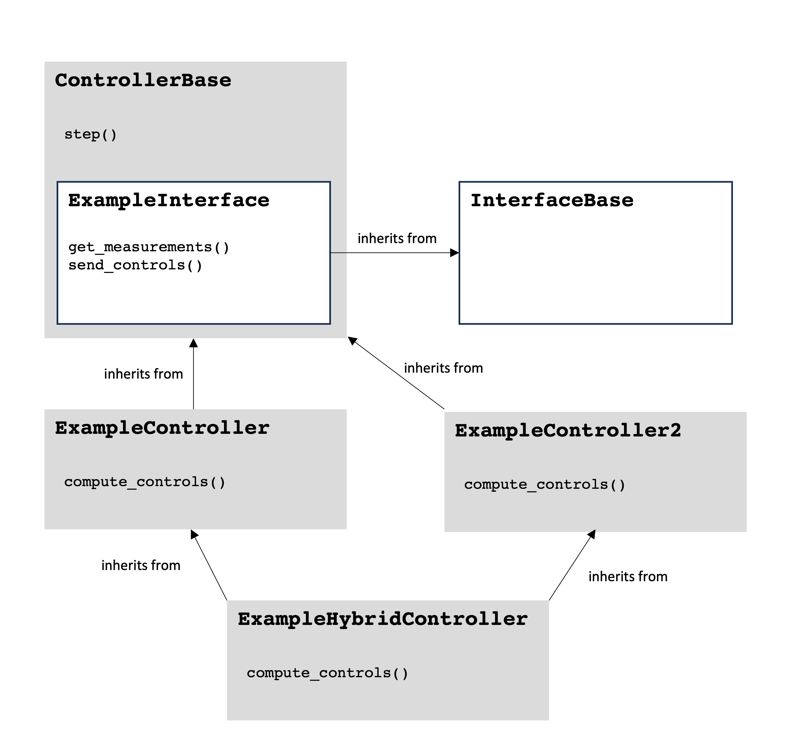

# Wind Hybrid Open Controller (WHOC)

The Wind Hybrid Open Controller (WHOC) is a python-based tool for real-time 
plant-level wind farm control and wind-based hybrid plant control.
WHOC will primarily be run in simulation, although we intend that it could be 
used for physical plants in future. 

The graphic below demonstrates the organization of the WHOC repository and 
the controller objects that it contains.

`ControllerBase` is the core underlying class, which newly implemented 
controllers should inherit from. Inheritance is shown using arrows in the 
diagram above. The key method of `ControllerBase` is the `step()` method,
which progresses the controller by receiving plant measurements; computing 
controls (which must be implemented in the children of 
`ControllerBase`); and sending the controls back to the plant. Children of 
`ControllerBase` should inherit `step()` rather than overloading it.
Additionally, on instantiation, `ControllerBase` expects to receive an 
instantiated `interface` object (discussed next). For information can be 
found in controllers.md.

The `interface` object handles communications with the plant simulator, 
allowing WHOC to be used with various simulation platforms (e.g. Hercules, 
FAST.Farm) while keeping the controllers agnostic to the simulation platform
and the boilderplate code needed to handle different platforms. `interface` 
objects should inherit from `InterfaceBase`. More information can be found in 
interfaces.md.

We anticipate that, in future, multiple levels of inheritance may be useful 
when defining top-level controllers that operate hybrid power plants with 
various different assets. This situation is shown below, and we intend to 
support such usage of WHOC.

